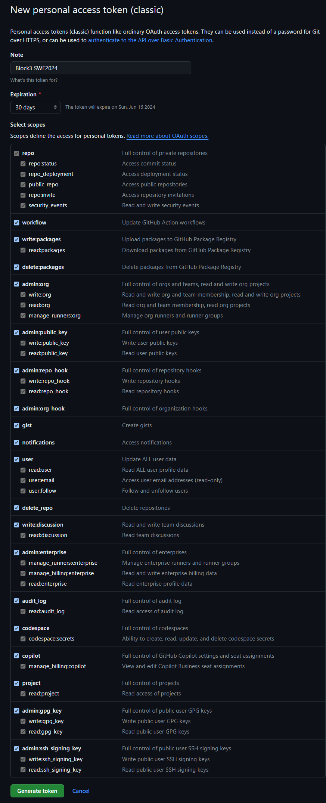
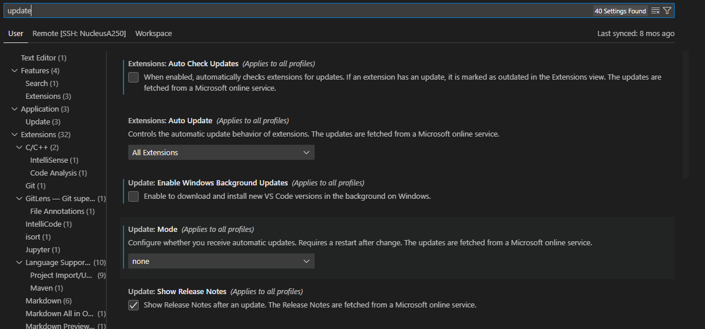
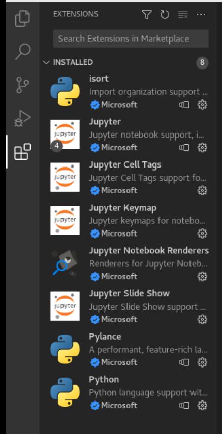

# Block 3: Course Setup Instructions

## Part 1: Setup Git Repository:

1) Login to your github account associated with the course: https://github.com/UTSW-Software-Engineering-Course-2025
2) Make a new repository for this week: https://github.com/organizations/UTSW-Software-Engineering-Course-2025/repositories/new
    * Recommended: Follow naming conventions: (i.e. Module_2_INSERT_YOUR_NAME_HERE)
3) Copy the associated git HTTPS link to somewhere you can find it:
    * ex: https://github.com/UTSW-Software-Engineering-Course-2025/Module_2_INSERT_YOUR_NAME_HERE.git

    **IMPORTANT:** Ensure you copy the HTTPS link; not the SSH link (ssh link looks like git@xxxxx).
4) If you do not yet have a personal access token associated with your git account, follow these instructions to create one. O/w skip to step 5

### Git personal access token:
Assuming you are logged into your git account:

4.1) Settings:

 

4.2) Developer Settings:

 

4.3) Personal access tokens --> tokens (classic):

 

4.4) Generate new token (classic):

4.5) Click generate token:

Make a name for your token, and set an expiration date if you desire a shorter/longer token life. 
You could be more selective with the scopes you select, but I'd recommend just selecting them all unless you know what you're doing.

**IMPORTANT:** Ensure you copy the token and save somewhere easy to access

1) Ensure you have your assigned training account, password, and node

### Part 1: Summary
Personal recommendation is to have the following information saved somewhere very easy to access (such as .txt on desktop)
key | value | notes 
 --- | --- | ---  
Node | 172.18.227.xx | Where xx is your assigned node
Account | trainXX    | where xx is your assigned training account
Password |        | ... (you get the idea)
github_username |       | github username assigned with course - you will need to enter this every pull / push you make 
github_token    |       | the personal access token (instructions above) - you will need to enter this every pull / push you make
github_https_upstream | https://github.com/UTSW-Software-Engineering-Course-2024/Module_2_INSERT_YOUR_NAME_HERE.git | 

## Part 2: Node Access & IDE Setup 

We will provide instructions for two methods you may use for development throughout the week. If you choose to use an alternate means, it will be on you to debug any connectivity issues.

### Method 1: VNC Node & Jupyter notebook development

1) Go to the biohpc and login to your training account: https://portal.biohpc.swmed.edu/content/
2) Go to webdesktop page:
   * GUI: "cloud services" --> "Web Desktop"
   * Link: https://portal.biohpc.swmed.edu/intranet/terminal/webdesktop/
3) Launch a new webdesktop session on your appointed node:
 

Once launched, you should see something like this: 
 

4) Click connect with VNC client.  A download should start automatically. Once complete, click the download file.
     ○ If you haven't downloaded VNC, there is a link appropriate for your OS above the webdesktop session box
  
  If you prefer, you can work on the browser window, but working through VNC is recommended.

5) Login to the node using the same training account username and password

Upon login you should see somethign like this:

6) Navigate to and open the terminal

### Method 2: VSCode SSH & Development

1) Download OS appropriate copy of VSCode version 1.98.X: https://code.visualstudio.com/updates/v1_98

**IMPORTANT:** If you use VSCode version >= 1.99.X, you will not be able to connect to the BioHPC.

2) Follow the standard install instructions associated with the download. Default settings are sufficient.

**IMPORTANT:** While not strictly necessary, I would **highly** recommend disabling auto update to VSCode. If you do not, you will likely end up having to re-install v1.98.X many times.

3) Launch VSCode and navigate: File > Preferences > Settings or [Cntrl+,] and search "update". Set `Update: Mode` to `none`.  I also recommend unchecking boxes such that your IDE looks like the image below:

4) You may double check your VSCode Version using: Help > About

5) Navigate to the Extensions tab [Ctrl+Shift+X] and download the following extensions. The latest versions of these extensions may work, but in case of error use the specified versions below.

Extension | Version | 
 --- | --- | 
`Remote - SSH` | 0.119.0 | 
`Remote Explorer` | 0.4.3 | 
 `Remote - SSH: Editing and Configuration Files`  |   0.87.0     |

6) Once complete you can now use the shortcut: [Ctrl+Shift+P] and go to `Remote-SSH: Open SSH Configuration File` and select the first option in the dropdown menu.

7) Now you can setup your config file like so:
Host NAME_YOUR_NODE
  HostName 172.18.227.xx
  User trainXX

8) Save your changes to the config file then `Remote-SSH: Connect to Host` and select the host you just set up. You will be prompted to enter the password associated with your training account. Once connected, you will be able to open up a terminal [Ctrl+~] and see `trainXX@NucleusXXXX ~`.

### Part 2: Summary
If all the above steps were completed correctly, you should be logged into your assigned training account, have a webdesktop session on your assigned node, and have the terminal open on your GUI.

It should looks something like this either in VSCode or on a WebDesktop session: 

## Part 3: Cloning lectures and assignments:

1) Begin by cloning the course materials from the following link: https://github.com/UTSW-Software-Engineering-Course-2025/Module_2_Materials.git
> git clone https://github.com/UTSW-Software-Engineering-Course-2025/Module_2_Materials.git

You will be prompted to enter your github username (which you conveniently have at hand from part 1) and press ENTER.
The password will be the github token (which you also conveniently have at hand from part 1). press ENTER 

2) Change directories into the cloned repository and set the remote origin to **YOUR** github repo created in part 1.
> cd Module_2_Materials
> 
> git remote set-url origin https://github.com/UTSW-Software-Engineering-Course-2025/Module_2_INSERT_YOUR_NAME_HERE.git
> 
> \# (optional) You can check to make sure this worked by:
> 
> git remote -v

If you perform the optional step you should see:

3) Push the cloned environment to your repo:
> git branch -M main
> 
> git push -u origin main
> 
> \# Username prompt
> 
> \# git-token prompt

### Part 3: Summary
At this point you should have a copy of all the materials from the course that have been provided at this time. Over the course of the week, we will add additional files to the repository. 

In order to get the most updated files you can:
> git remote set-url origin https://github.com/UTSW-Software-Engineering-Course-2025/Module_2_Materials.git
> 
> git pull
> 
> \# Username prompt
> 
> \# git-token prompt
> 
> git remote set-url origin https://github.com/UTSW-Software-Engineering-Course-2025/Module_2_INSERT_YOUR_NAME_HERE.git
> 
> git remote -v

## Part 4: Conda Environment Setup:

There are 3 conda environments that we have already created for you that you will use for the exercises in this block.

* In the terminal, cd into the Module_2_Materials folder and Execute the following commands:
> source 03_CondaEnvironment/install_montillo_conda_env.sh

This command will take a few seconds to execute.

* Each subsequent time You will need to activate each conda environment with: 
> source 03_CondaEnvironment/activate_montillo_conda_env.sh 

**IMPORTANT:** 
* If you are using **Web Desktop**, you will need to use jupyter notebook in the console at this time and moreover, this will be your primary code editor. This can be done by simply running `jupyter notebook` in the terminal.
* If you are using **VSCode SSH**, you may choose to run `jupyter notebook` in the terminal OR install the Python and Jupyter Extensions for VScode. 
  *  Upon loading VSCode you may see notifications pop up in the bottom right hand corner asking if you want to install python and jupyter extensions. You will want to install the recommended extensions from this notification. If you don't see this, the extensions may have already been installed. Navigate to the extensions page and check to make sure the following extensions are installed and enabled:

3) Selecting the Kernel 
   * Jupyter Notebook: So long as all the previous instructions have been followed, the kernel `montillo_conda_env` should be visible for selection in the top right:  
    

   * VSCode: 
       1) [Ctrl+Shift+P] 
       2) Python: select python interpreter
        3) `/project/nanocourse/SWE_OOP/shared/CondaEnvs/bin/python`
        

### Part 4: Summary

You are now ready to complete the tasks for this block of the assignment! Putting it all together, your console might look something like this:

